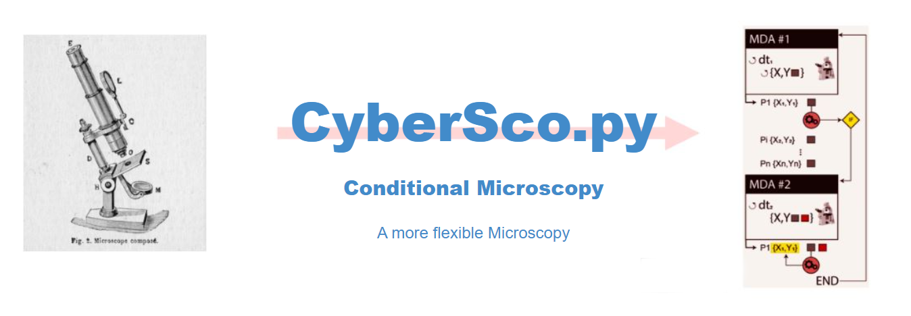

# CyberSco.py

Flexible and user friendly *Conditional Microscopy*

## Introduction

**CyberSco.py** is a software written in Python for performing *Conditional Microscopy*.
It was conceived to be available to none expert users with a simple intuitive GUI interface
and easy syntax for predefined experiments. It uses *Machine Learning* segmentation
for extracting information for the conditional steps.

## Installation

### Anaconda installation

Go to https://www.anaconda.com/products/individual and install Anaconda

#### Virtual environment

<details>
<summary>Creation of a virtual environment, click here to expand</summary>

in a terminal write:
```bash
conda create -n env_name python=3.7.7 anaconda
```
For activating :
```bash
conda activate env_name
```
For deactivating :
```bash
conda deactivate
```

</details>

### GPU installation :

full information for installation procedure can be found here :
[GPU support for Windows](https://shawnhymel.com/1961/how-to-install-tensorflow-with-gpu-support-on-windows/)

<details>
<summary> installation in short, Click here to expand</summary>

    Here is a summary of the different steps for the GPU installation:
    1. cuda_10.1.243_426.00_win10.exe

       can be found at https://www.filehorse.com/download-nvidia-cuda-toolkit/42676/

    2. cudnn-10.1-windows10-x64-v7.6.5.32.zip

       can be found at https://developer.nvidia.com/rdp/cudnn-archive
       In the unfolded list of Download cuDNN v7.6.5 (November 5th, 2019), for CUDA 10.1

    3. Copy 3 files from cudnn to Cuda

       - bin: Copy <cuDNN directory>\cuda\bin\*.dll to C:\Program Files\NVIDIA GPU Computing Toolkit\CUDA\vxx.x\bin
       - include : Copy <cuDNN directory>\cuda\include\*.h to C:\Program Files\NVIDIA GPU Computing Toolkit\CUDA\vxx.x\include
       - lib : Copy <cuDNN directory>\cuda\lib\x64\*.lib to C:\Program Files\NVIDIA GPU Computing Toolkit\CUDA\vxx.x\lib\x64

    4. check that you have in the environment variables those 2 paths :

       - C:\Program Files\NVIDIA GPU Computing Toolkit\CUDA\vxx.x\bin
       - C:\Program Files\NVIDIA GPU Computing Toolkit\CUDA\vxx.x\libnvvp

</details>

### Installation of few devices

<details>
<summary>Click here to expand</summary>

### Installing *XCite exacte*

Go to :
[Xcite dlls](https://www.excelitas.com/product/x-cite-xled1-multi-triggering-led-illumination-system)  
Extract the zip file, turn on the XCite device, then in device manager,
add new device using the extracted folder with all the dlls

### Installing *Zyla Andor* camera

Go inside *CyberSco.py/drivers/pyAndorSDK3*
and run :
```bash
python3 –m pip install .
```

</details>

### Installing Python dependencies

Open an Anaconda terminal in *CyberSco.py* folder,
activate the *virtual environment* and run:
```bash
python setup.py install  
```

## Launching the application

Go in the folder *CyberSco.py* and click on
```
run.bat
```
You can also create a shortcut on the Desktop for an even faster access.

It will launch *two consoles*, one for the *camera* and another for the
*CyberSco.py* interface.
**Do not click inside of these cmd windows as it can perturb the script execution**.
The loading page takes around half a minute to finish due to machine
 learning models loading. Once the models loaded a *Begin* button appears.

## How to add your own machine learning model
Machine learning models are stored in the folder *CyberSco.py/models*.
They can be used for segmentation or for event detection. For the moment,
 *CyberSco.py* only accepts models produced with *Tensorflow*.

<details>
 <summary> Configuration files for the models, Click here to expand</summary>

The user needs to provide also three other configuration files
in the folder *CyberSco.py/modules/settings*:
* The file *models.yaml* which contains the correspondences
 between the models and their shortcut.
* The file *curr_models.yaml* which contains the shortcut for the *principal segmentation model*.
* finally the file *event_model.yaml* which contains the shortcut
 for the model devoted to the *event detection*.

</details>

## Image analysis method to extract cell information

The different experiments presented in this paper rely on the utilization of
 *two segmentation models* with the UNET architecture.  The trainings were
 performed using *Nvidia  GeForce GTX 1080 GPU* card with *Tensorflow 2.2.0* and
  with data augmentation spanning the transformations of rotation
   (6 angles), flip operation, noise,
   colors, and contrast.

### Segmentation

<details>
<summary> The two segmentation models, Click here to expand</summary>

The first model is used for segmenting the yeast cells at 20x and the second
one for segmenting the yeast cells at 60x.

The first model (20x) was trained on 15 epochs (in 15 minutes) from a training
 set of 20 pictures.
The masks were obtained from RFP pictures in conjunction with OTSU algorithm.  

BF 20x             |  BF with segmentation 20x
:-------------------------:|:-------------------------:

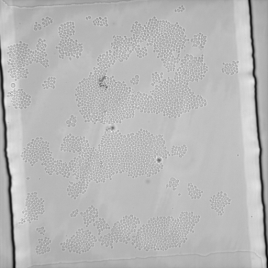 | 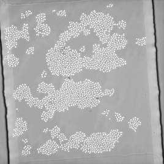

The  second model (60x) was trained on 5 epochs (in 5 minutes) from a training
 set of 20 pictures. This training set was obtained from fluorescence signal
  RFP images which were used for creating a model which trained multiple
   times permitted to enlarge the masks until having a good cell segmentation.  


BF 60x             |  BF with segmentation 60x
:-------------------------:|:-------------------------:
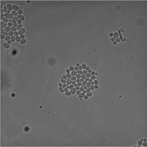 | 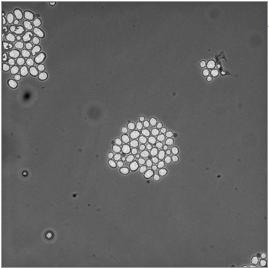

</details>

### Tracking

In the current *CyberSco.py* version, the tracking for a given cell is simply done by selecting
the cell the nearest from one image to the following.  
When changing of position, the tracking is performed using correlation between images.

<details>
<summary> Tracking image example, Click here to expand</summary>

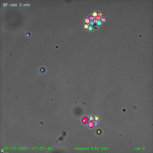

</details>

## Graphical User Interface

Here are screenshots to explain how to use the Graphic User Interface(GUI):

<details>
<summary> Interface overview with functionalities, Click here to expand</summary>

### Overview

The interface is divided in tree parts. A window for selecting the view and
 making snapshots, a middle panel for building the MDA experiment and a
  green vertical bar for accessing to various utilities like the
  Settings Channels, a panel for controlling the quality of the segmentation etc ...

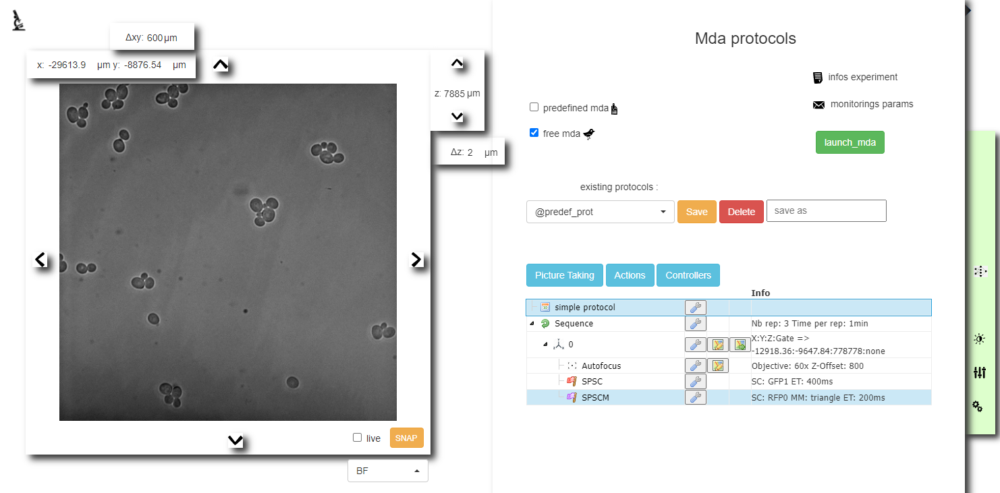

### Changing the view and focus

Change the current view or select the view for the MDAs.
 Positions in X,Y,Z can be entered directly
or obtained by clicking on the arrows after having setting displacement step.

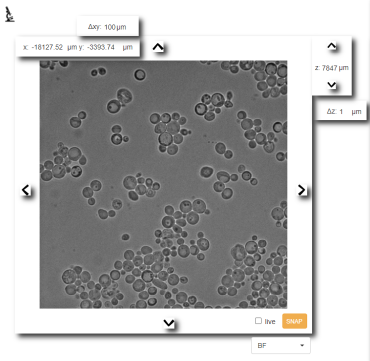

### Snapshots

Take snapshot with different illuminations with superimposing on the BF image.

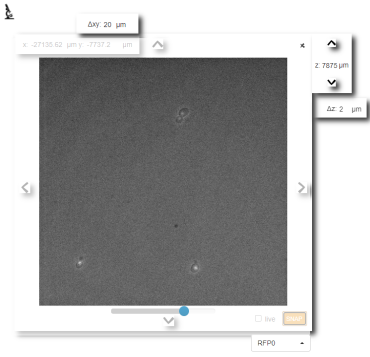

### Settings channels

Create various illumination settings used in the MDAs.

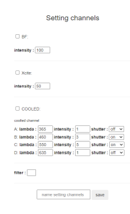

### Control of segmentation quality

Check the quality of the segmentation in real time.

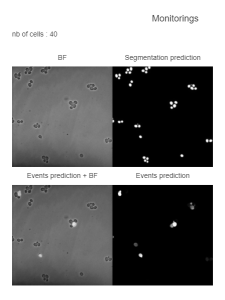

### Hand back and sweep chip

Retrieve the hand control of the microscope and make composite image of
 the chip in a larger field of view.

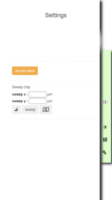

### Devices connexion and GPU

Check which devices are correctly connected and read the information about the GPU.

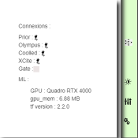

</details>

## Doing MultiDimensional Acquisitions (MDAs)

### free MDA and Tree tool
<details>
<summary> Making a MDA, Click here to expand</summary>

It is easy to build a MDAs experiment using the tree graphical tool.
The tree is available once the user has selected, *predefined MDA* or *free MDA*
In the case of the *predefined MDA* all the elements of the tree are yet there.
The user can only duplicate, move them but cannot add new ones.

The tree encapsulates graphically the MDA through the hierarchy of the serial
 instructions (sent to the microscope and the associated devices) and the loops.
To add a new elementary action just drag and drop it from the three select menus
 (blue selectors) inside the tree. You can modify the hierarchy position of the
  actions using ```ctrl+arrow```. To modify the parameters of each action in
the tree, click on the corresponding *wrench icon*.

#### Tree overview

The tree tool for conceiving a MDA (for free MDA option) is three folds: A part for creating,
 changing or deleting MDAs,
a part for dragging and dropping actions in the tree (three blue selectors) and
finally the tree itself containing the loops and actions of the MDAs.

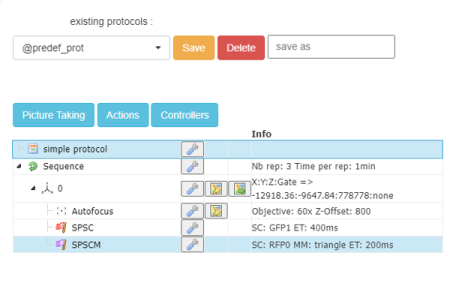

#### Tree menus

When clicking on a blue selector, various actions are available.
The firsts selector contains... the second one.. and the last one ..

#### Changing the parameters of each action

It is possible to set the parameters for each step of the MDA by clicking
on the *wrench button*. This opens a windows in which the parameters can be modified.

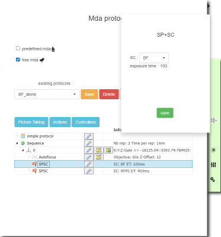


</details>

### predefined MDA

Predefined MDA use the tree tool but without the possibility to add new elements in the tree.
The user can only duplicate and change the elements yet in place in the tree.
You can find all the conditional experiments used in the paper as python file plugins
 in the folder *modules>predef>plugins*

<details>
<summary> plugin structure, Click here to expand </summary>

In *CyberSco.py*, a *plugin* program consists of a python class with the name of the experiment which inherits from the *MDA class*.
This class contains *the class initialisation*  ```__init__()```  of which comment is used to produce the name of the experiment and its description that will appear as a tooltip window when hovering on the experiment name in the interface.
The syntax must be  ```name : name_of_the_experiment``` for the name and  ```description : place_here_the_description``` for the description.
The plugin is then divised in three *blocks*.
* The *main MDA block*  determined by the ```define() ``` method  which contains the MDA instructions written serially and finishing by the  ```self.launch_loop() ``` function.
* The *MDA initialisation block*  determined by the two methods : ```init_on_positions()```  and ```init_conditions()```
* And lastly the *MDA conditional block* determined by the method ```check_conditions() ``` which will be executed after each iteration.

</details>

#### Example of a conditional experiment preset

<details>
<summary> Plugin code example for <i> Sucrose lag </i> experiment, Click here to expand </summary>

```python

from datetime import datetime
from modules.mda import MDA


class PROTOCOL_SUCROSE(MDA):
    '''
    Sucrose protocol for observing lag time according to the number of cells..
    '''
    def __init__(self, ldevices=None):
        '''
        name : Sucrose lag experiment
        description : the cells (which are able to use sucrose cooperatively) of different chambers are fed with glucose and counted in real time. Their supply is then stopped and replaced with sucrose when the number of cells reaches a given limit. For each chamber this limit is different. The counting continues and it is possible at the end of the experiment to observe from the cells counting, the lag phenomenon which is  characterized by a time during which the cells do not divide or very slowly until being able to exploit cooperatively the sucrose.
        '''
        MDA.__init__(self, ldevices)

    def define(self, debug=[0]):
        '''
        '''
        self.refocus()                       # add refocusing
        self.take_pic()                      # add take BF pic
        ##
        self.analyse_pic()                   # analyse the pic
        self.cond = 'sucrose'                # apply the conditions 2, sucrose
        ##
        self.launch_loop()                   # Loop

    def init_on_positions(self):
        '''
        Initialize the protocol
        '''
        for pos in self.list_pos:
            pos.event = self.event
            pos.first_time = self.first_time
            if pos.event.name:            # same event on all the positions
                pos.event.exists = True

    def init_conditions(self):
        '''
        Setup parameters and initial conditions
        '''
        self.init_on_positions()
        ##
        lthresh = [ 100, 500, 2000, 500 ]      # list of the thresholds
        for i,pos in enumerate( self.list_pos ):
            pos.thresh_cells = lthresh[i]        # initial delay
        self.delay = self.delay_init = 2
        self.repeat = 2400                       # number of repetitions

    def check_conditions(self, rep):
        '''
        At a given threshold trigger the sucrose
        '''
        for pos in self.list_pos:
            if pos.nb_cells > pos.thresh_cells and not pos.switched :
                # pos.num_gate exists
                if pos.num_gate:                                                  
                    pos.switched = True       # position blocked
                    # adding num gate to self.gates_blocked
                    self.gates_switched += [ pos.num_gate ]                       
                    print( f'self.gates_switched '
                      '{ self.gates_switched } for nb cell of { pos.nb_cells } ' )
                    #  change gates value
                    self.ga.set_pos_indices( self.gates_switched, 1 )             


```

</details>

## Contact

Pascal Hersen pascal.hersen@curie.fr

## License

<a rel="license" href="http://creativecommons.org/licenses/by-nc-sa/4.0/"></a><br />Ce(tte) œuvre est mise à disposition selon les termes de la <a rel="license" href="http://creativecommons.org/licenses/by-nc-sa/4.0/">Licence Creative Commons Attribution - Pas d’Utilisation Commerciale - Partage dans les Mêmes Conditions 4.0 International</a>.
